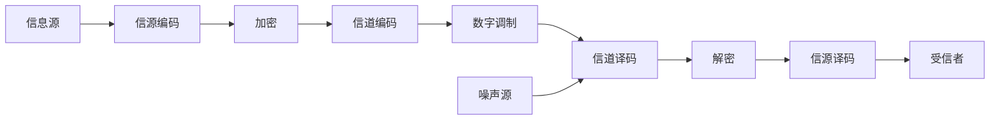

# 概述
## 计算机在网络时代的作用
- 网络指三网
    - 电信网
    - 有线电视网
    - 计算机网
- 因特网的意义
    - 通信方面的最大变革
    - 生活、学习、工作离不开因特网
---
## 因特网的发展
1. 20世纪50年代
    - 数据通信技术是基础
    - 分组交换理论
    - APRANET的成功
    - TCP/IP的运用
2. 20世纪90年代
    - E-mail、FTP
    - Web技术
3. 20世纪90年代末
    - 移动通信技术是基础
    - 智能手机、平板可穿戴设备促进移动互联网的发展
4. 物联网 2010至今
    - 感知技术传感器技术的发展提供基础
---
## ARPANET的发展
- 20世纪60年代
- 传统电路交换缺点
    - 通话链路被炸毁，通信信路就要中断
    - 重新建立连接要耗费一些时间
- 需求
    - 用于数据传送，而不是打电话
    - 连接不同的计算机
    - 网络结点同等重要
    - 必须有冗余路由
    - 简单并且可靠
## ARPANET设计
网络拓扑结构
> 集中式
 分布式网络
 ---
## 交换的含义
> - switching(转接)——把一条电话线路转接到另一条线路
> - 动态分配传输线路的资源
- 电路交换特点
    1. 面向连接
    2. 连接、通信、释放连接
- 电路交换的缺点
    1. 传送数据效率低(计算机数据所有突发性)
---
## 分组交换原理
- 步骤
  1. 划分报文为数据段
  2. 添加首部构成分组
  3. 以分组为单位传送数据
  4. 接收端还原去首部还原成报文
- 首部的作用
  1. 含有地址等控制信息
  2. 结点交换机根据首部转发到下一个交换机
- 结点交换机的工作过程
  1. 缓存分组
  2. 查找转发表
  3. 从适当端口转发
- 分组交换的优点
  1. 高效：动态太分配带宽
  2. 灵活：分组传送和查找路由
  3. 迅速：不用先建立连接
  4. 可靠：完善的网络协议
- 分组交换的缺点
  - 存储转发时的排除时延
  - 首部的信息造成额外的开销
---
## 因特网时代
1. ARPANET分组交换网
2. NSFNET三级网络
   - 主干网
   - 地区网
   - 校园网
3. NSFNET被ISP网络所代替
4. 今日多级网络
    >网络接入点NAP
    >国家主干网
    >地区ISP
    >本地ISP
    >校园网
---
- 因特网标准的四个阶段
  - 因特网草案
  - 建议标准（RFC)文档
  - 草案标准
  - 因特网标准
## 计算机网络的分类
1. 网络定义
> 互相连接的、自治的计算机的集合
> 将不同地理位置上的多个计算机通信线路连接起来，以实现资源共享和通信
---
### 广播式
- 通信过程
    1. 只有一个通信通道，任何一个机器发送信息，其他机器都会收到
    2. 只有一个地址域，指明目标接收者
    3. 查看地址域，分组是自己的才接收
### 点到点
-  通信过程
    1. 多个整个网络由通道构造，每个通道对应一对机器
    2. 经过多个中经机器
---
### 广域网
- 组成
    - 资源子网
        - 主机与终端、网络软件、数据资源
    - 通信子网
        - 路由器、互联设备、通信线路
### 城域网
- 以IP协议为基础，三网融合
- 主要特征：
    - 光纤传输网
    - 高端路由器和多层交换机
### 局域网
### 个域网
###　体域网
## 网络的主要性能指标
- 带宽
  - 信道所能传送的“最高数据率”
- 发送时延
  - 数据块进入传输媒体所需时间
- 信道带宽
  - 数据在信道上的发送速率
- 传播时延
  - 电磁波在信道 上传播一定距离而花费的时间
- 处理时延
  - 交换结点为存储转发而进行一些处理所花费的时间
- 往返时延RTT
  - 发送数据开始到接收到确认所需时间
## 计算机网络体系结构
- 层
  - 信息隐蔽、抽象数据类型、面向对象
  - 向上提供服务
---
- 分层的好处
  - 各层独立性好
  - 灵活
  - 结构上可分开
  - 易于实现和维护
  - 能促进标准化工作
---
- 协议
  - 对等实体之间关于如何进行通信的一种规则约定
---
协议的组成要素
> 语法：数据或控制信息的格式
> 语义：发出何种控制信息、完成何种响应、做出何种动作
> 同步：事件实现的详细说明
---
实体
> 发送或接收信息的软件进程
---
服务访问点SPA
> 相邻两层实体进行交互的地方
---
计算机网络体系结构
> 层及协议的集合
---
OSI与TCP/IP参考模型
|OSI体系结构|TCP/IP体系结构|
|:---:|:---:|
|应用层|应用层|
|表示层||
|会话层||
|运输层|运输层(TCP/UDP)|
|网络层|网际层|
|数据链路层|网络接口层|
|物理层||
---
各层的功能介绍

|序号|层|作用 |
|:---:|:---:|:---:|
|7|应用层|网络应用进程|
|6|表示层|数据表示|
|5|会话层|主机之间的通信|
|4|传输层|端对端的连接|
|3|网络层|选择最优路由|
|2|数据链路层|接入介质|
|1|物理层|二进制传输|
---
- 物理层（比特）
  - 用多少伏特的电压表示0和1
  - 每个电压持续时间
  - 连接介质的设计
- 数据链路层（帧）
  - 差错控制
  - 流量控制
  - 物理地址
  - 介质访问控制（报文）
- 网络层（分组）
  - 路由发现
  - 路由选择
  - 网络互连
  - 拥塞控制
- 传输层（报文）
  - 为计算机进程提供端对端的可靠传输
  - 屏蔽底层的通信细节
- 会话层
  - 负责维护两个会话主机之间连接的建立、管理和终止，以及数据的交换
- 表示层
  - 数据格式的变换、加密、解密数据压缩与恢复

# 物理层
## 物理层协议的内容
- 机械特性
  - 指明接口所用接线器的形状和尺寸、引线数目、固定和锁定装置
- 电气特性
  - 接口电缆各线的电压范围
- 功能特性
  - 某一电平电压表示何种意义
- 规程特性
  - 不同功能的各种事件的出现顺序 

## 数字通信的基础知识
###　基本术语
- 信息:对客观事物属性的认识
- 数据：反映客观事物属性的记录
  - 数据是信息具体表现形式
  - 数据附带的意义就是信息
- 信号：数据的电气表现
- 基带信号
  - 信源发出的原始电信号
- 频带信号
  - 基带信号经过变换后的信号

### 通信方式
- 单式通信
- 双工通信
- 全双工通信
###　傅立叶级数
- 任何周期为T的函数都可以分解为（无限个)正弦和余弦函数
- 进行傅立叶分解的作用
   - 复杂信号转为简单信号的叠加，简化处理
   - 舍掉能量很小的部分，进一步简化处理
### 信号的带宽
- 信号会衰减
- 信号会变形（傅里分量的衰减速不同）
  - 频率越高，衰减越严重
- 振幅不会明显减弱的频带称为传输介质的带宽
### 传输速率
- 码元：一个信号
- 比特：二进制中的位
- 码元传输速率B
- 信息传输速率S
- $S=B×\log_2 V \ bps$
  - V:不同码元的个数
### 恩奎斯特准则
- 每赫带宽的理想低通信道的最高码元传输速率是2个码元。
- 比特率为：$2H\times\log_2 V$
### 香农公式
- 带宽受限且有高斯白噪声干扰
- 极限信道传输速率:
  - $C = H \log_2 {(1+ S/N)} $ 
  - H:带宽
  - S：信号平均功率
  - N：噪声功率
### 调制与信源编码
- 调制
   - 用调制信号控制载波的参数，使载波的某个或某些参数按照信号的规律变化，从而使得已调信号按照含有的调制信号的全部特征
- 解调
  - 恢复调制的信号
- 目的
  - 减小天线（低频需要长的天线）
  - 实现多路复用
  - 提高抗干扰能力
### 数字基带常用码型
- 比特流：1001010
- 不归零：1 -1 -1 -1 -1 1 1
- 归零制
- 曼彻斯特编码：
  - 0：低→高
  - 1：高→低
- 差分曼彻斯特编码：
  - 在**信号位**开始时不改变信号极性，表示辑"1"
  - 在**信号位**开始时改变信号极性，表示逻辑"0" 
  - 如果**中间位**电平从低到高，则表示0；
  - 如果**中间位**电平从高到低，则表示1；
###　数字调制
- 二元数字调制
  - 振幅、频率、相伴只有两种变化
  - 2ASK
  - 2FSK
  - 2PSK
###　正交调制QAM
  - 可选m种相位，n种振幅
### 抽样定理
- 对于一个有限带宽的模拟信号，若抽样速率足够在，抽样值能够完全代表模拟信号本身
- 只需传输抽样值，接收端就能复原为原始的模拟信号
## 物理层下的传输媒体
### 传输媒体
- 双绞线
  - 信号衰减较大，传输距离受限
- 同轴电缆
- 光纤